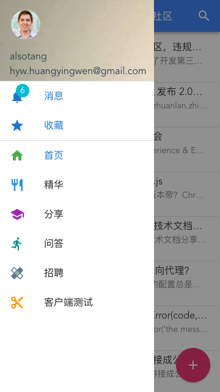
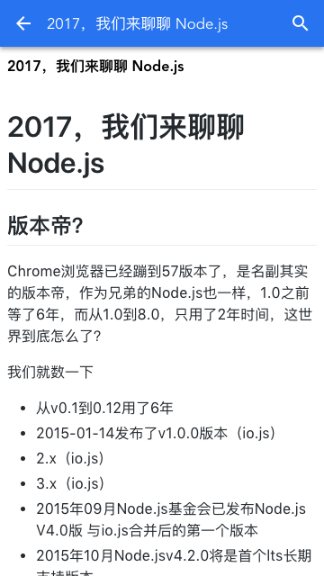
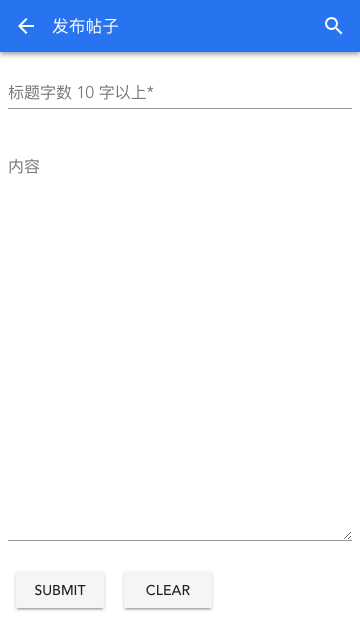
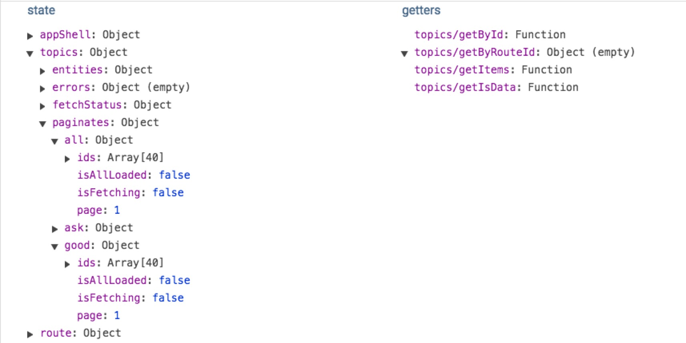

# vue-ssr-cnode

> vue 服务端渲染，基于 vue-cli pwa 模板修改










## Build Setup

```bash
# install dependencies
npm install

# serve with hot reload at localhost:8080
npm run dev

# build for production with minification
npm run build

# build for production and view the bundle analyzer report
npm run build --report

# 启动项目
npm start

# run unit tests
npm run unit

# run e2e tests
npm run e2e

# run all tests
npm test
```
